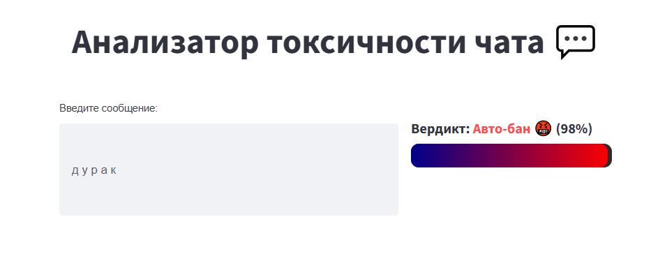
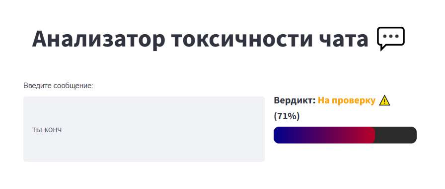
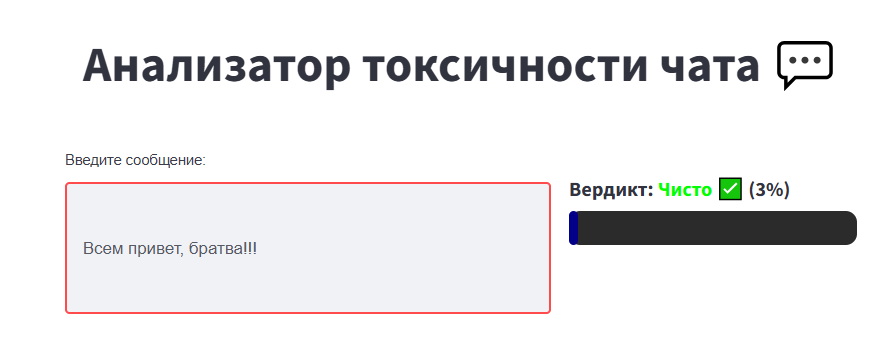
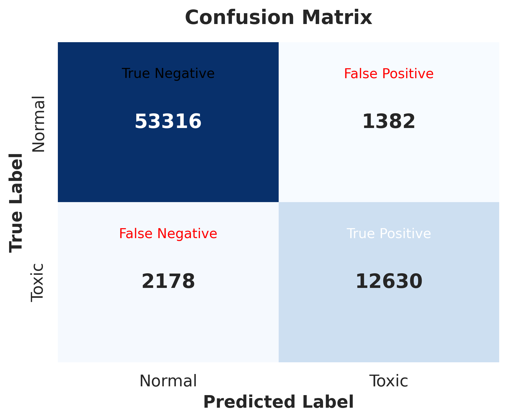
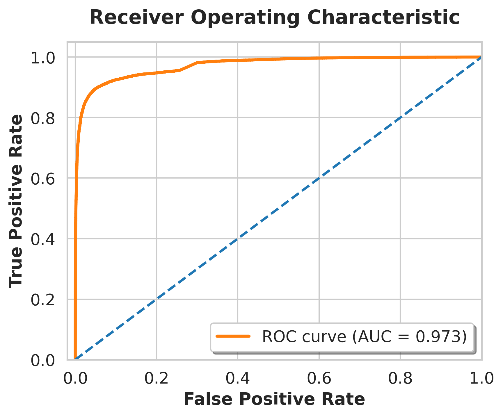
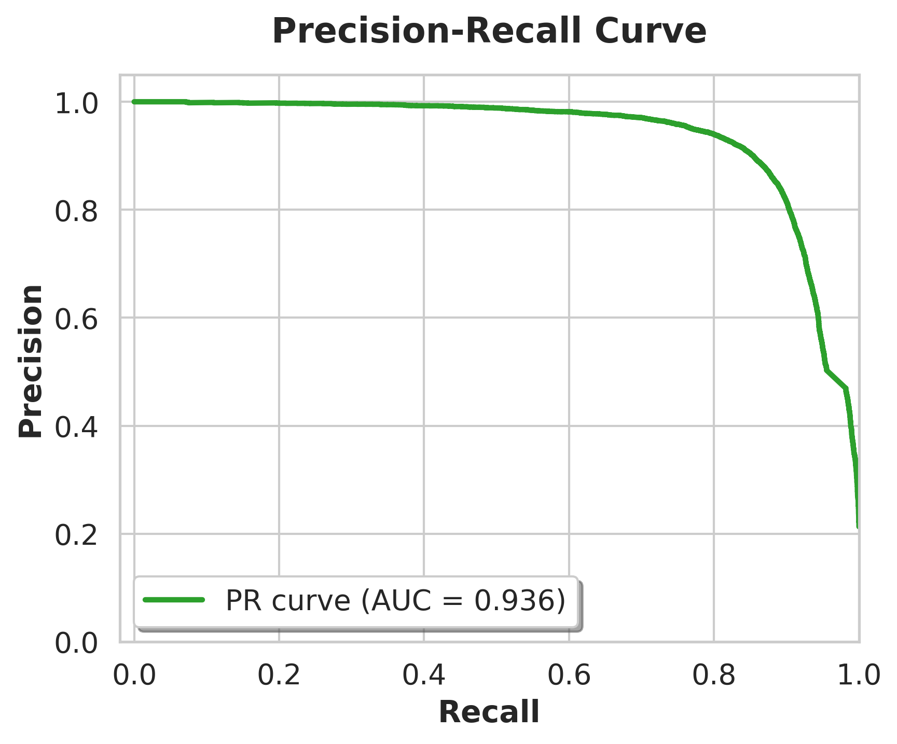
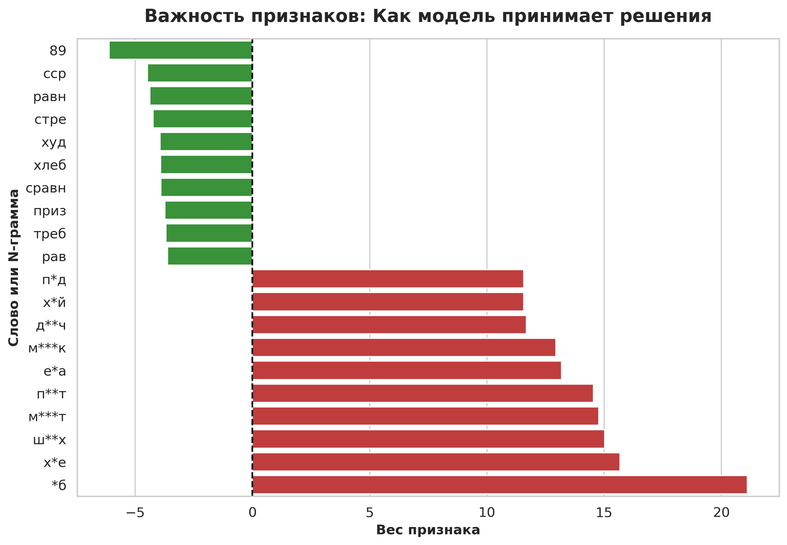

# 🛡️ Russian Toxic Chat Detector (Анализатор токсичности сообщений)


Микросервис для фильтрации токсичных сообщений и мата в русскоязычных чатах. Проект решает бизнес-задачу автоматической модерации с упором на **устойчивость к обходу фильтров** и **минимальную задержку (< 2мс на CPU)**.

## 📌 Особенности проекта

Кастомный пайплайн очистки текста (`src/text_cleaner.py`), который делает модель практически непробиваемой для пользователей, пытающихся обойти бан.

*   **Декодирование Leetspeak:** Распознает замену букв цифрами (например, `су444ка` -> `сучка`).
*   **Склейка разрядки:** Собирает слова, написанные через пробел (`д у р а к` -> `дурак`).
*   **Удаление сложной маскировки:** Очищает слова от внедренных спецсимволов (`ш__л---ю***х...а` -> `шлюха`).
*   **Перевод омоглифов:** Заменяет английские буквы, визуально похожие на русские, обратно на кириллицу (например, `cукa, pидoр` -> `сука, ридор`).
*   **Распознавание эмодзи:** Переводит эмодзи в текстовый формат (🤬 -> `:лицо_с_символами_на_рту:`) для анализа контекста.

## 💻 Демонстрация интерфейса

В проекте реализована трехуровневая система оценки (Чисто / На проверку / Авто-бан) с debounce-откликом при вводе.

<p align="center">
    
    
    
</p>

## ⚙️ Архитектура и пайплайн машинного обучения

Модель построена на базе классического, но высокооптимизированного Machine Learning подхода, что позволяет использовать ее в Real-time чатах (пропускная способность ~750 RPS на одном ядре процессора).

*   **Датасет:** `Mnwa/russian-toxic` (Hugging Face). Сбалансирован с помощью весов классов.
*   **Препроцессинг:** очистка + стемминг (`SnowballStemmer`) + удаление стоп-слов.
*   **Векторизация (Feature Engineering):** объединение двух TfidfVectorizer:
    *   по словам: `ngram_range=(1, 2)`
    *   по символам (`char_wb`): `ngram_range=(3, 5)` — критически важно для отлова видоизмененного мата без пробелов.
*   **Алгоритм:** `LogisticRegression` 
*   **Бизнес-логика:** вместо классического бинарного порога внедрена трехуровневая логика:
    * `prob` >= 0.85: авто-бан.
    * 0.50 <= `prob` < 0.85: на проверку.
    * `prob` < 0.50: чисто.
## 📊 Метрики качества модели

Модель показывает превосходную способность разделять классы на тестовой выборке (69 506 сообщений).

| Класс | Precision | Recall | F1-Score | Support |
| :--- | :---: | :---: | :---: | :---: |
| 🟢 Норма (0) | 0.96 | 0.97 | 0.97 | 54 698 |
| 🔴 Токсик (1) | 0.90 | 0.85 | 0.88 | 14 808 |
| **ROC-AUC** | \- | \- | **0.9725**| \- |

### Визуализация метрик

<p align="center">
  
  
  
</p>

### Интерпретируемость модели

Модель логистической регрессии позволяет точно понять, на какие именно паттерны реагирует алгоритм. Анализ весов показывает, что модель успешно выучила как конкретные слова-триггеры, так и символьные n-граммы (части слов), что делает ее устойчивой к опечаткам и преднамеренному искажению грубых слов.

<p align="center">
  
</p>

## 📁 Структура проекта

```text
toxic_dashboard/
├── src/                      # Исходный код пайплайна
│   ├── __init__.py           
│   ├── text_cleaner.py       # Хардкорная очистка текста и RegEx
│   └── model_handler.py      # Загрузка весов и инференс
├── images/                   # Скриншоты и графики для README
├── app.py                    # Пользовательский интерфейс (Streamlit)
├── requirements.txt          # Зависимости
├── Dockerfile                # Инструкции для сборки образа
└── toxic_classifier.joblib   # Обученные веса модели и векторизаторы
```

## 🚀 Быстрый запуск

Для запуска приложения на любой ОС без конфликтов зависимостей требуется только установленный [Docker](https://www.docker.com/).

1. Клонируйте репозиторий:
```bash
git clone https://github.com/Mesenyov/toxic-chat-detector.git
cd toxic-chat-detector
```

2. Соберите Docker-образ:
```bash
docker build -t toxic-app .
```

3. Запустите контейнер:
```bash
docker run -p 8501:8501 toxic-app
```

Приложение будет доступно в браузере по адресу: [http://localhost:8501](http://localhost:8501)